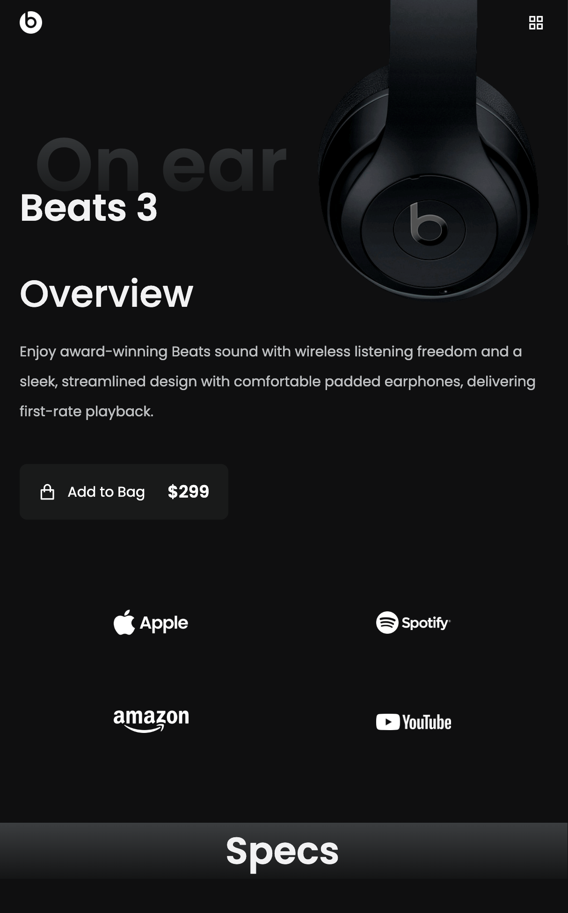
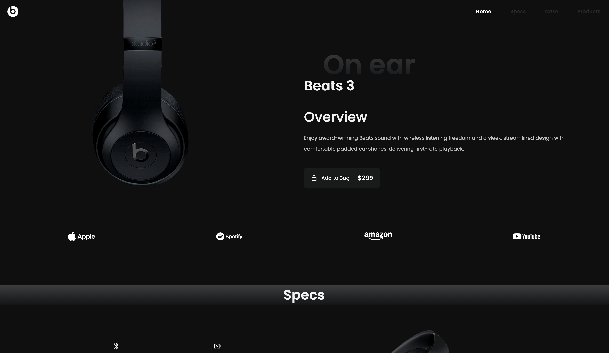

# Beats Studio Headphones

---

This a single-page static website of the Beats 3 Studio Headphones made to practice my skills in web development.

The website contains 4 sections:

-  Home
   -  Introduction of the product
   -  Sponsors of the headphones
-  Specs
   -  List of features included in the headphones
-  Case
   -  Description of the case offered along with the headphones
   -  Discount offered while purchasing now through the website
-  Products
   -  Selection of the different style of Beats 3 headphones that you can choose
   -  Contact section included below

Technologies used:

-  Html
-  Scss
-  Javascript

Things I learned:

-  More practice with Grid layout css.
-  How to organize my scss files.
-  Remember to make a designated Contact section.
